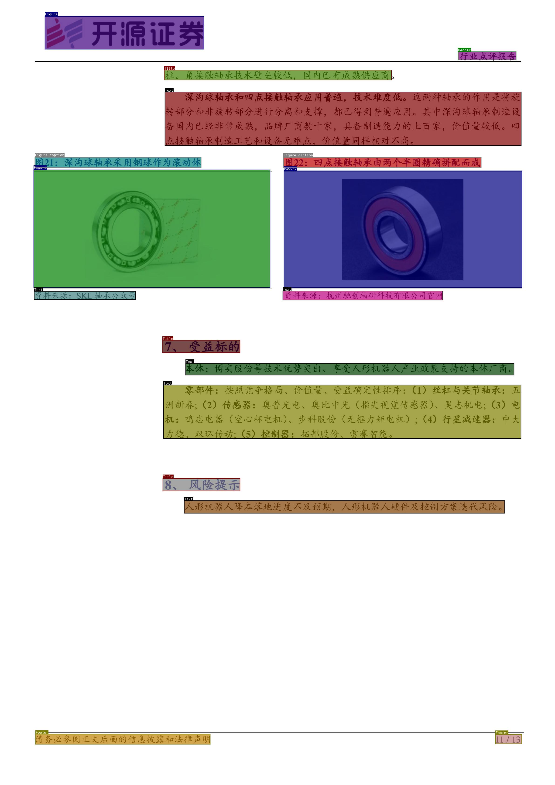
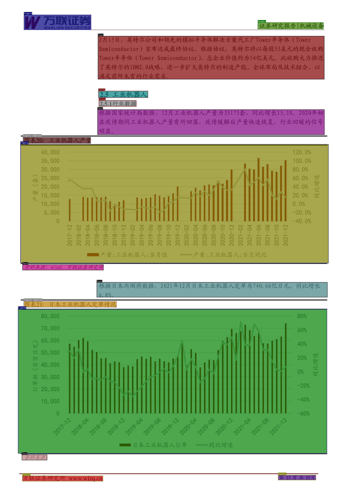

# 360LayoutAnalysis

[English](./README_EN.md)

## 一、背景

在当今数字化时代，文档版式分析是信息提取和文档理解的关键步骤之一。文档版式分析，也称为文档图像分析或文档布局分析，是指从扫描的文档图像中识别和提取文本、图像、表格和其他元素的过程。这项技术在自动化文档处理、电子数据交换、历史文档数字化等领域有着广泛的应用。

传统的文档版式分析模型往往难以准确区分文档中的段落和其他布局元素，这限制了文档信息的进一步处理和利用，而深度学习和模式识别技术的发展为文档版式分析带来了新的机遇，通过训练数据集，可以提高模型对文档结构的理解能力，但高质量的标注数据集是训练有效模型的基础。

在文档版式分析中，精细化的标注非常有必要，其中：段落的标注尤其关键，因为它直接影响到文本的语义理解和信息提取。当前，在版式分析领域，据我们了解，在论文场景中，以往的开源数据集如：CDLA（A Chinese document layout analysis），缺乏对段落信息的标注；在研报场景中的版式分析模型还相对空缺。

因此，为了解决这一问题，我们通过人工标注的方式对论文文档进行细粒度标签改造以及数据优化，并构建起研报场景细粒度版式分析数据集，最好利用这些标注数据集，训练了多个全新的中文文档版式分析模型，在**封闭测试集上表现优异**。

本次开源，我们优先开源了面向**论文**和**研报**两个场景的版面分析轻量化模型权重及相应的标签体系，旨在能够识别文档中的段落边界等信息，并准确区分文本、图像、表格、公式等其他元素，最终推动产业发展。

## 二、使用

- 权重下载地址：[🤗LINK](https://huggingface.co/qihoo360/360LayoutAnalysis)

- 使用方式：

  开源权重使用`yolov8`进行训练，预测方式如下：

  ```python
  from ultralytics import YOLO
  
  image_path = ''  # 待预测图片路径
  model_path = ''  # 权重路径
  model = YOLO(model_path)
  
  result = model(image_path, save=True, conf=0.5, save_crop=False, line_width=2)
  print(result)
  ```

  

## 三、版面分析
### 3.1 论文场景

- 标签类别

  | 元素           | 名称         |
  | -------------- | ------------ |
  | Text           | 正文（段落） |
  | Title          | 标题         |
  | Figure         | 图片         |
  | Figure caption | 图片标题     |
  | Table          | 表格         |
  | Table caption  | 表格标题     |
  | Header         | 页眉         |
  | Footer         | 页脚         |
  | Reference      | 注释         |
  | Equation       | 公式         |

- 示例
<div align="center">
    
    
</div>


### 3.2 研报场景
- 标签类别

  | 元素           | 名称         |
  | -------------- | ------------ |
  | Text           | 正文（段落） |
  | Title          | 标题         |
  | Figure         | 图片         |
  | Figure caption | 图片标题     |
  | Table          | 表格         |
  | Table caption  | 表格标题     |
  | Header         | 页眉         |
  | Footer         | 页脚         |
  | Toc            | 目录         |

  

- 示例

  <div align="center">
      
      
  </div>


## License

This project utilizes certain datasets and checkpoints that are subject to their respective original licenses. Users must comply with all terms and conditions of these original licenses.The content of this project itself is licensed under the [Apache license 2.0](./LICENSE.txt).


## 许可证

本仓库源码遵循开源许可证Apache 2.0。360LayoutAnalysis模型开源模型支持商用，若需将本模型及衍生模型用于商业用途，请通过邮箱([360ailab-nlp@360.cn](mailto:360ailab-nlp@360.cn))联系进行申请， 具体许可协议请见[《360LayoutAnalysis模型开源模型许可证》](./360LayoutAnalysis开源模型许可证.txt)。